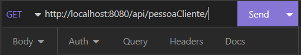
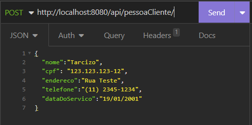
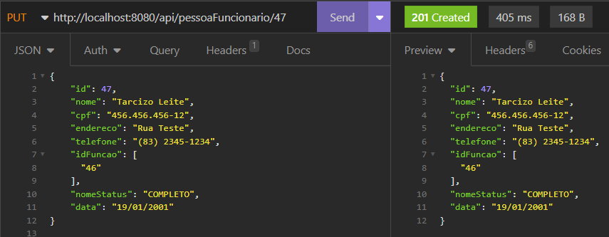
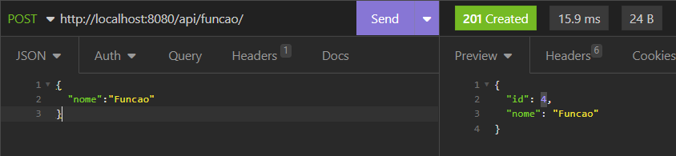
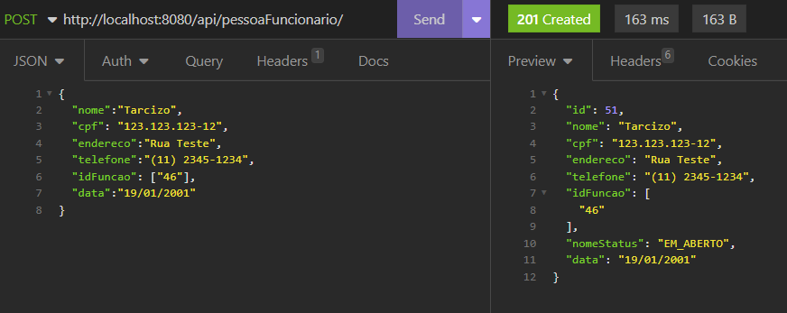
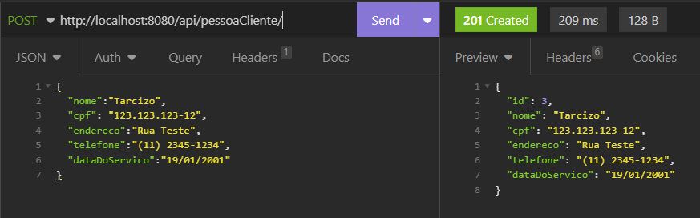

# DesafioRPE

## Dependências:
Git

PostgreSQL

Maven 

JavaSE-17

## Obtendo o código-fonte:

Com o Git instalado em seu computador, é necessário abrir um terminal de linha de comando (no Windows o Git Bash ).

Cole o comando descrito abaixo:

git clone `https://github.com/tarcizojr/DesafioRPE.git`

## Executando:

Após efetuar o Download do código, e abri-lo no seu editor de código, é importante certificar se as dependências foram baixadas.

Também é necessário que seja criado uma Base de Dados no PostgreSQL com o nome DesafioRPE, para que quando o código seja executado, todas as tabelas sejam criadas.

Feito isso podemos executar o código.

## Utilização

A utilização dos Endpoints da API são simples, para visualizar de uma forma inicial como se dá o funcionamento de cada uma, com o código executando, abra no seu navegador a seguinte página:

`http://localhost:8080/swagger-ui.html`

Nele você poderá ver cada um dos Endpoints disponíveis, como utilizados e quais as possíveis respostas, além de executar algum deles.

Para isso basta clicar sobre o  endpoint, e irá aparecer os parâmetros necessários para o seu funcionamento (caso necessário) e a possível resposta (Responses), para executar e ver funcionando, basta clicar no canto superior direito em “Try it out“.

Ao clicar irá aparecer os campos de parâmetros (caso necessário) e o botão de para executar o endpoint. 

Após a execução, será apresentado o resultado “Response” da aplicação.

Também pode ser utilizado programas como Postman ou Insomnia, para utilizar o endpoints.

### Utilização com Postman ou Insomnia:

Para utilizar algum dos endpoints em algum programa, basta abrir o programa desejado e criar um novo Request, nesse Request  é necessário colocar o URL para fazer a requisição, para ver qual a URL correta, basta clicar novamente em “Try it out“ executar, que na parte inferior irá aparecer um campo chamado “Request URL”,  nele pode ser visualizado a URL para fazer a Requisição. 

Para executar também será necessário verificar qual o tipo de requisição que será feita GET, POST, PUT ou DELETE e selecionar no programa, após isso, caso a requisição desejada for GET, pode executar e ver o resultado da requisição (lembre-se de verificar se o código está sendo executado).
Segue o exemplo: 

Para as demais requisições deve se atentar aos parâmetros necessários para execução.

**POST**: para essa requisição é necessário ir na opção de Body do programa como o Insomnia e selecionar a opção JSON, e dentro do campo criar o corpo do objeto que deseja ser salvo, se atentando na forma como demonstrada na página Swagger.

Segue o exemplo:

**PUT**: para atualizar um elemento já salvo, precisa primeiramente do Id desse elemento, que pode ser visto ao utilizado endpoint do tipo **GET** usando o /all (onde será listado todos os elementos), como na imagem abaixo:

Assim basta copiar as informações da entidade que deseja atualizar, copiar para o corpo da requisição e alterar o que desejar. Lembrando de passar o id na URL.

Segue o exemplo:
(Se comparado com a imagem acima, pode ser percebido a alteração do CPF, Telefone e Nome )

## Utilização

A utilização da API é feita dando a possibilidade do usuário criar Função (a qual será atribuída a um usuário Pessoa Funcionário), em que mais de uma pessoa poderá exercerá a mesma função e uma Pessoa Funcionário poderá exercer mais de uma função, a API também permite o cadastro de Pessoa Funcionário e Pessoa Cliente.

Para utilizar primeiro temos que tomar cuidado caso seja desejado criar uma Pessoa Funcionário precisamos ter pelo menos uma Função criada para poder atribuir a Pessoa Funcionário.

> Criando Função

Para criar uma função precisamos apenas informar no corpo da requisição o nome da função que deseja criar.

> Criando Pessoa Funcionário

Para criar uma entidade do tipo Pessoa Funcionário, precisamos passar no corpo da requisição as informações de Nome, CPF, Endereço, Telefone, Data de Contratação e uma lista contendo a Função ou Funções que o Funcionário exerce.

> Criando Pessoa Cliente

Assim como criamos uma entidade Pessoa Funcionário, a entidade Pessoa Cliente é tão fácil quanto, precisando apenas passar no corpo da requisição as informações de Nome, CPF, Endereço, Telefone e Data do último serviço.

> Os Demais Métodos 

Os demais métodos para se trabalhar com Função, Pessoa Funcionário e Pessoa Cliente estão dispostas na página do Swagger citada acima, a utilização básica também já foi comentada na parte “”Utilização com Postman ou Insomnia””.
